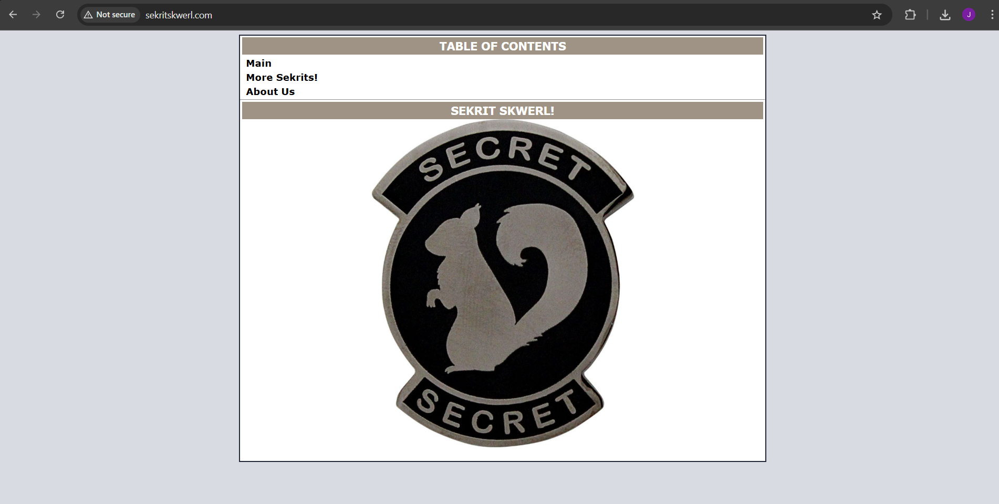
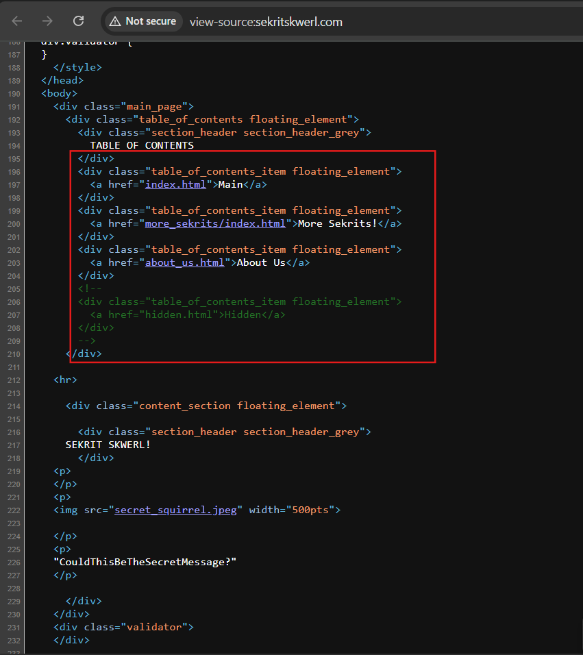
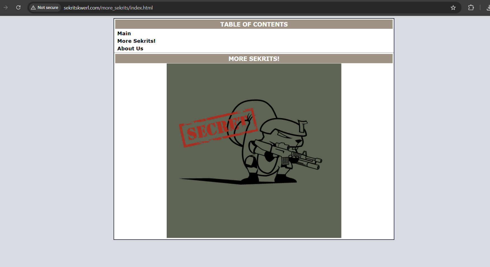
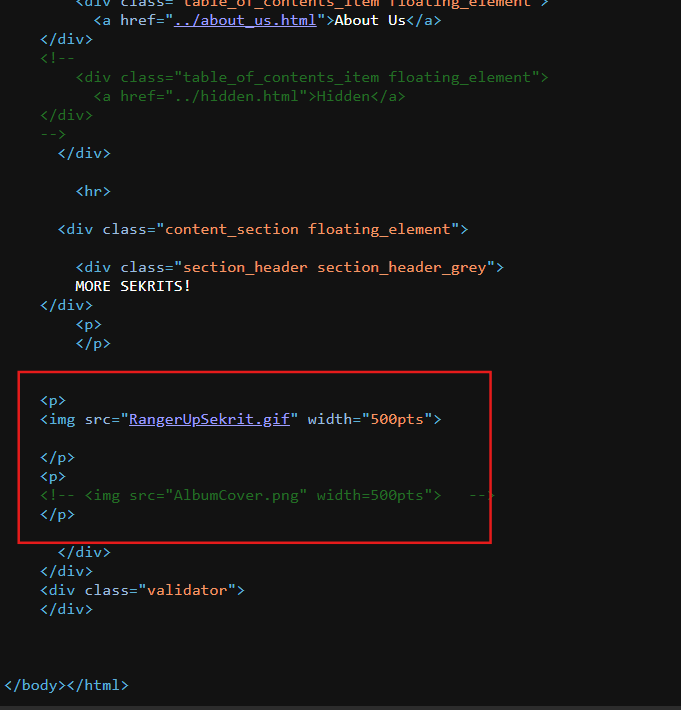
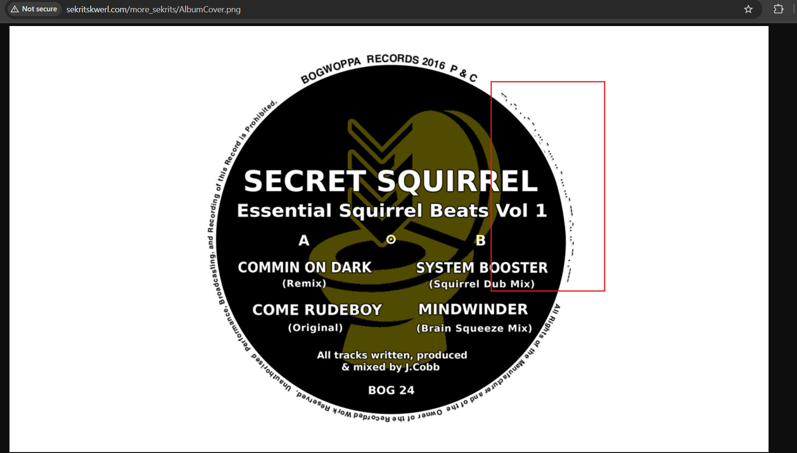

#  Sekrit Skwerl – CTF Walkthrough

##  Challenge Details

- **Name:** Sekrit Skwerl  
- **Category:** Web  
- **Objective:** Find the hidden flag  
- **URL:** http://sekritskwerl.com/  
- **Flag Format:** Plain text

---

##  Tools Used

- Browser (Inspect Element)
- curl / wget
- Morse Code decoder
- Image viewer 
- Common sense & patience!

---

## 🔍 Walkthrough

### 1️⃣ Initial Recon

Visited the URL in a browser:

```text
http://sekritskwerl.com/

```



Inspected the page source (Ctrl+U) and found commented-out content:

```html
<!-- <a href="hidden.html">Hidden</a> -->
```

Also found these working links:
    about_us.html
    more_sekrits/index.html




In the about_us.html page we 

http://sekritskwerl.com/about_us.html

In the source script of  about_us.html page we 
Found a decoy flag in an HTML comment:

<!-- flag{sometimesFlagsAreInHTMLComments}> -->

But it is not a flag


```
Visited: http://sekritskwerl.com/more_sekrits/index.html

```



In the source page :



While inspecting the HTML source of the http://sekritskwerl.com/more_sekrits/index.html page, I found two key  tags inside a <p> tag:

The first image, RangerUpSekrit.gif, was openly included on the page and viewable directly.
 I saved this GIF and analyzed it using tools like binwalk and steghide, although steghide didn’t support the format.

The second image, AlbumCover.png, was commented out — not displayed on the webpage but still accessible directly if you manually browse to it:

```
http://sekritskwerl.com/more_sekrits/AlbumCover.png
```

Upon opening the image, I noticed Morse code visually embedded around the edge of the record label.




### Morse Code Observed:

```
--. .-. . .- - . ... - .... .. - ... ...- --- .-.. ..- -- .----

```

I used morsecode.world to decode it.

### Decoded Text :
```
GREATESTHITSVOLUME1

```

The Final Flag is identified as  "GREATESTHITSVOLUME1"


### What I Learned

🔍 Web Exploration & HTML Inspection
- Learned to inspect HTML source code using developer tools and view-source to uncover hidden content.
- Discovered that comments in HTML (<!-- ... -->) can sometimes hold clues or even fake flags.

🖼️ Hidden Files & Manual Access
- Understood that commented-out elements (like image tags) are not loaded, but the resources can still be accessed manually if you know the path.
- Practiced manually navigating URLs to uncover hidden or unlinked files.

🎯 Image-Based Clues
- Discovered how visual clues can be hidden inside images (like Morse code around the border).
- Learned that steganography tools like steghide and binwalk don’t always work if the format isn't supported — and sometimes the answer is just in what you can see.

🔡 Decoding & OSINT Tools

- Used online Morse code decoders to convert symbols into readable text.
- Learned that not all flags follow a flag{} format — some are plain strings.


